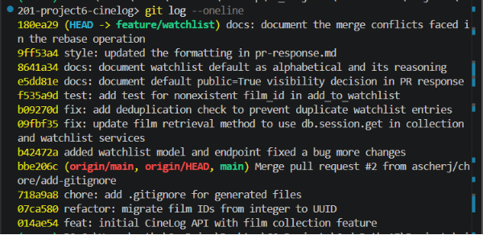

# PR Response Doc — CineLog Watchlist Feature

## AI Usage
1. Asked AI tool Claude to tell me how to approach each comment.
2. Asked Claude to understand the deduplication logic in add_to_collection()
3. Used Claude to write the tests in comment 3 following the structure of tests in the test_collection.py file. All tests passed.

## Comment 1 — Rename
**What I did:** I renamed save_to_watchlist to add_to_watchlist per naming convention in services/watchlist_service.py. I also renamed the function call in routes/watchlist/watchlist.py. I found the call in this file using ctrl + f.
**How I verified:** I verified that I renamed the function in all files by hitting ctrl + f in all files to see whether the save_to_watchlist function was present in any of them.

## Comment 2 — Deduplication
**What I did:** I wrote a deduplication check in add_to_watchlist() and created an AlreadyInWatchlistError error when a film already appears in the user's watchlist.
**How I verified:** I verified this by checking the deduplication logic in add_to_collection() and writing my check with a similar pattern.

## Comment 3 — Missing test
**What I did:** I created a new file for the watchlist tests called test_watchlist.py. I added tests for nonexistent film_id in add_to_watchlist() in this file following the same fixture and assertion structure as test_add_to_collection_nonexistent_film_raises().
**How I verified:** I verified this test works by running the test and passing 100%.

## Comment 4 — Default visibility
**My position:** Watchlists should continue to default to `public=True`.

**Reasoning:** A public default lets other users see a person's film taste, which supports community engagement — people with similar taste can find each other, and friends or followers can get a better sense of what someone is into without having to ask. On a film-tracking app like CineLog, discovery and social connection are part of the core value, and a watchlist is lower-stakes to share than something like private messages or account details — it's closer to a public reading list than to sensitive personal data.

**Tradeoff acknowledged:** This does mean any user who assumed their watchlist would be private has that assumption broken by default. Someone might not want their upcoming viewing habits visible — for example, if they're using the watchlist to track something they'd rather keep to themselves. Since we don't currently expose a way to opt out, users who want privacy have no path to it under this default. If we want to keep `public=True` as the default, I'd argue we should still expose an explicit `public` parameter on `add_to_watchlist()` (as in the stretch goal) so users aren't stuck with the default with no way to change it.

## Comment 5 — Sort order
**My position:** Watchlists should continue to default to alphabetical order.

**Reasoning:** When a user is trying to recall the name of a film they've been meaning to watch, an alphabetical list is easier to scan than a chronological one — they can jump straight to the letter instead of remembering roughly when they added it.

**Engagement with reviewer's point:** I agree that recently added films are often the ones most connected to a user's current taste, and date-added order would surface that more naturally. But I think the two orderings solve different problems — alphabetical helps you find a specific film, date-added helps you see what's fresh — and I don't think one strictly dominates the other for this feature. Rather than picking one as the sole default, I'd propose adding a sort toggle near the watchlist header so users can switch between "A–Z" and "Recently added" based on what they're trying to do in the moment. Until that's built, I'm keeping alphabetical as the default since it's the existing behavior and the safer choice for findability.

## Comment 6 — Rebase
**What conflicted:** Merge conflict in .gitignore. The commit message "fix: add deduplication check to prevent duplicate watchlist entries" was committing an accidental change in .gitignore that I did not intend to make.
**How I resolved it:** I manually reviewed the previous and new versions of the .gitignore. Upon selecting that I wanted the current change rather than the incoming change, I git added the .gitignore file and the recommitted with the same message previously mentioned.
**How I verified no conflict remains:** I entered git rebase origin/main to see if the branch was up to date and it was. I also entered git status which showed me that there are no more conflicting files.

## PR Description
<!-- Written at the end — feature overview, design decisions, manual testing steps -->

@
## Overview
Adds a watchlist feature to CineLog, letting users save films they intend to watch, and addresses the six review comments on the original submission (full write-up in `pr-response.md`).

## Changes
- **`services/watchlist_service.py`** — new service with `add_to_watchlist()`, including a deduplication check that raises `AlreadyInWatchlistError` when a film is already on the user's watchlist.
- **`routes/watchlist/watchlist.py`** — watchlist endpoint, registered in `app.py`.
- **`services/collection_service.py`** — switched film retrieval to `db.session.get` for consistency.
- **`tests/test_watchlist.py`** — tests for the nonexistent-`film_id` path, following the fixture and assertion structure of `test_collection.py`.

## Design decisions
- Watchlists default to `public=True` to support discovery and social connection, with the caveat that an explicit `public` parameter should be exposed so users can opt out.
- Default sort stays alphabetical for findability; a sort toggle ("A–Z" / "Recently added") is proposed rather than swapping the default.

Reasoning for both is expanded in `pr-response.md`.

## Testing
All tests in `tests/test_watchlist.py` pass locally.
@